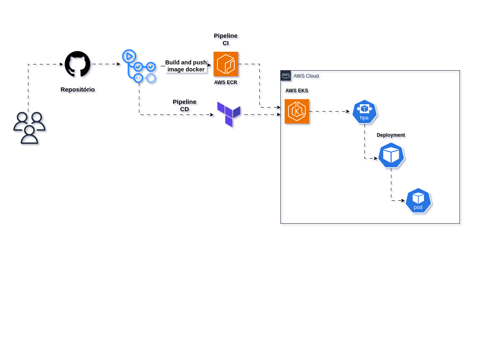

# Bem vindo ao projeto

### Este repositório contém um exemplo de implementação de uma pipeline de CI/CD para um cluster EKS (Amazon Elastic Kubernetes Service) e uma aplicação python.



[Clique aqui para abrir o diagrama com animação](diagrama/diagrama-projeto-eks.html)

## Introdução

### Este projeto implementa uma pipeline para automatizar a criação, a implantação e o monitoramento de aplicações em um cluster Amazon EKS. A pipeline utiliza ferramentas como kube-prometheus e Grafana para fornecer um ambiente completo e gerenciável.

## Pré-requisitos

* Conta AWS com acesso à CLI da AWS.
* Ferramenta `kubectl`, `aws-cli` e `git` instalada localmente.

## 1. Clone o repositório
```bash
git clone https://github.com/deividduarte20/projeto-pipeline-eks.git
```

## 2. Entre no diretório e branch template
```bash
cd projeto-pipeline-eks ; git checkout repo/template 
```

## 3. Preencha informações importantes para a pipeline de forma automatizada provida pelo shell script 
```bash
./start.sh
```

## 4. Adicione todos os arquivos não rastreados pelo git
```bash
git add .
```
## 4.1 Registra commit com mensagem
```bash
git commit -m "Add pipeline eks and manifests"
```
## 4.2 Cria nova branch
```bash
git checkout -b add/pipe
```
## 4.3 Envia alterações para o repositório remoto
```bash
git push origin add/pipe
```

## Passos da Pipeline

### 3. Criação do Cluster EKS

* Executa o build e push da imagem para o repositório no AWS ECR
* Executa o terraform provisionando eks
* Atualiza o kube-config
* Instala o metrics-server
* Deploy da aplicação python no namespace app
* Instala helm
* Instala kube-prometheus no namespace monitoring

### 4. Monitoramento

* O Prometheus coleta métricas do cluster EKS.
* O Grafana visualiza as métricas coletadas pelo Prometheus.

### 5. Rotas da API

**Health:** `/` </br>
**Métricas:** `/metrics`</br>
**Swagger:** `/apidocs` </br>
**Comentário:** `/api/comment/new` </br>
**Lista comentário:** `/api/comment/list/id`</br>

<strong>Ao fim do provisionamento automatizado via pipeline, temos alguns arquivos no caminho manifests/manifestos-adicionais/ que necessitam de alteração de informações como domínio</strong>

- Para execução dos manifestos após o passo anterior, execute:
```bash
kubectl apply -f manifests/manifestos-adicionais/*
```