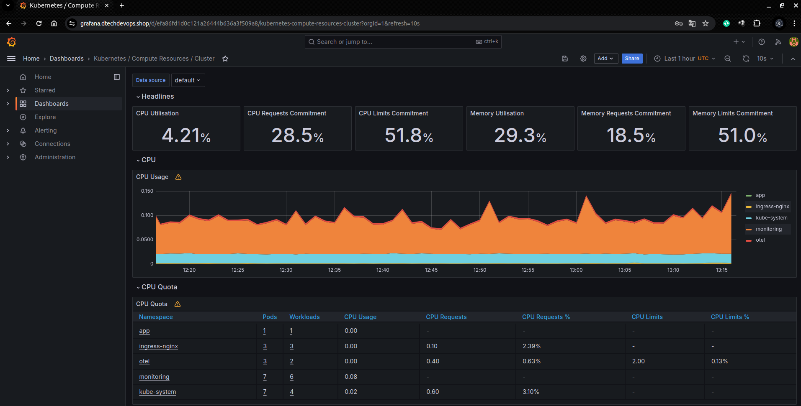
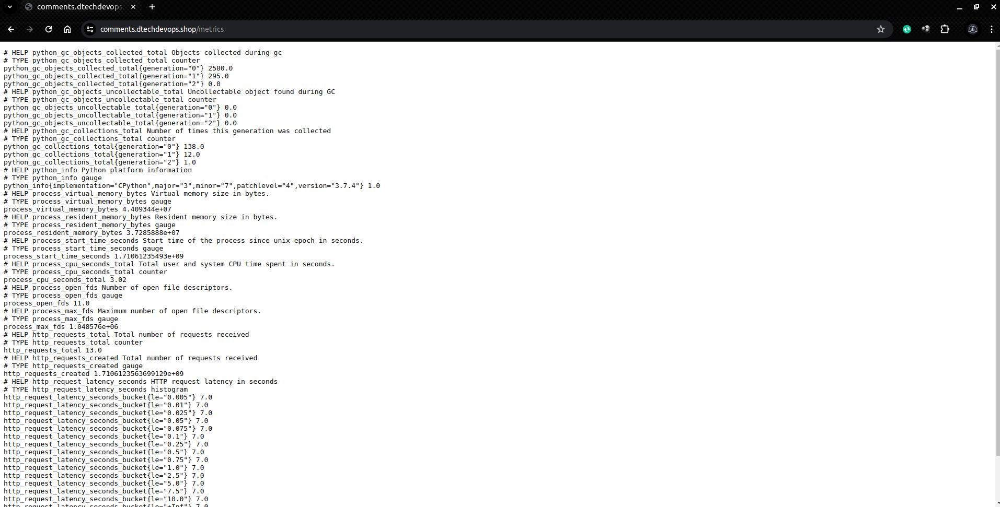
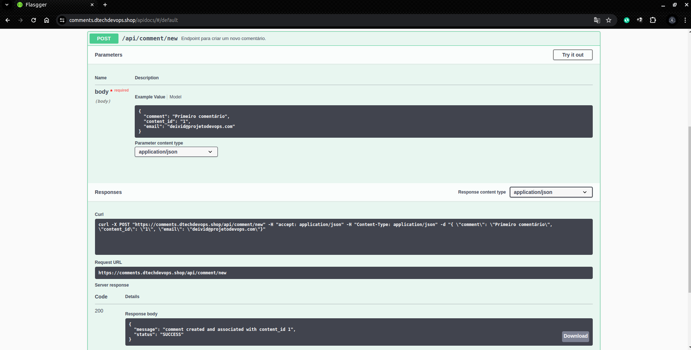
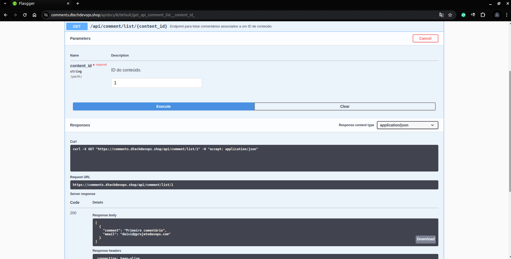
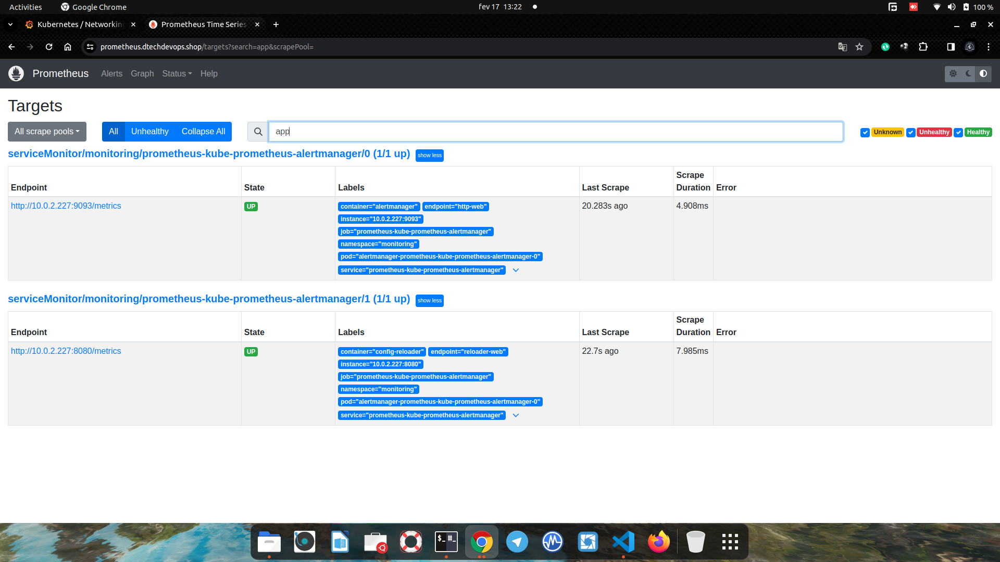

# Bem vindo ao projeto

### Este projeto implementa uma pipeline para automatizar a criação, implantação e o monitoramento de aplicação em um cluster Amazon EKS. A pipeline utiliza ferramentas como helm, kube-prometheus e Grafana para fornecer um ambiente completo e gerenciável.


## Pré-requisitos

* Conta AWS com acesso à CLI da AWS.
* Bucket para utilização de armazenamento do terraform state.
* Ferramenta `kubectl`, `aws-cli` e `git` instalada localmente.

## 1. Clone o repositório
```bash
git clone https://github.com/deividduarte20/projeto-pipeline-eks.git
```

## 2. Entre no diretório e na branch 
```bash
cd projeto-pipeline-eks && git checkout repo/template-1
```

## 3. Preencha informações importantes para a pipeline de forma automatizada provida pelo shell script 
```bash
./start.sh
```

## 4. Adicione todos os arquivos não rastreados pelo git
```bash
git add .
```
## 4.1 Registra commit com mensagem
```bash
git commit -m "Add pipeline eks and manifests"
```
## 4.2 Cria nova branch
```bash
git checkout -b add/pipe
```
## 4.3 Envia alterações para o repositório remoto
```bash
git push origin add/pipe
```

## Passos da Pipeline

### 3. Criação do Cluster EKS

* Executa o build e push da imagem para o repositório no AWS ECR
* Executa o terraform provisionando eks
* Atualiza o kube-config
* Instala o metrics-server
* Deploy da aplicação python no namespace app
* Instala helm
* Instala kube-prometheus no namespace monitoring

### 4. Monitoramento

* O Prometheus coleta métricas do cluster EKS.
* O Grafana visualiza as métricas coletadas pelo Prometheus.

### 5. Rotas da API

**Health:** `/` </br>
**Métricas:** `/metrics`</br>
**Swagger:** `/apidocs` </br>
**Comentário:** `/api/comment/new` </br>
**Lista comentário:** `/api/comment/list/id`</br>

<strong>Ao fim do provisionamento automatizado via pipeline, temos alguns arquivos no caminho manifests/manifestos-adicionais/ que necessitam de alteração de informações como domínio</strong>

### 6. Instale o nginx ingress controller

**Observação:** Antes de instalar o nginx ingress controller é necessário inserir o arn do certificado no manifesto deploy-nginx-ingress-controller.yaml na linha 348 e adicione a subnet do eks na linha 329

```bash
kubectl apply -f deploy-nginx-ingress-controller.yaml
```

### Aplique a regra de ingress da aplicação

**Observação:** Antes de aplicar a regra de ingress altere o domínio 
```bash
kubectl apply -f ingress.yaml
```

### Instale o jaeger
```bash
kubectl apply -f jaeger-manifest.yaml -n jaeger
```

### Aplique as regras de ingress do Grafana e Jaeger
**Observação:** Altere o domínio nos arquivos ingress-jaeger.yaml e ingress-grafana.yaml
```bash
kubectl apply -f ingress-jaeger.yaml
kubectl apply -f ingress-grafana.yaml
```

### Descobrir senha de acesso ao grafana
```bash
password=$(kubectl get secrets prometheus-grafana -n monitoring -o yaml | grep admin-password: | awk '{print $2}' | base64 --decode)
echo "Senha descriptografada: $password"
```

### Aqui estão alguns exemplos visuais do projeto:

#### Grafana


#### Métricas


#### Swagger



#### Prometheus
.
