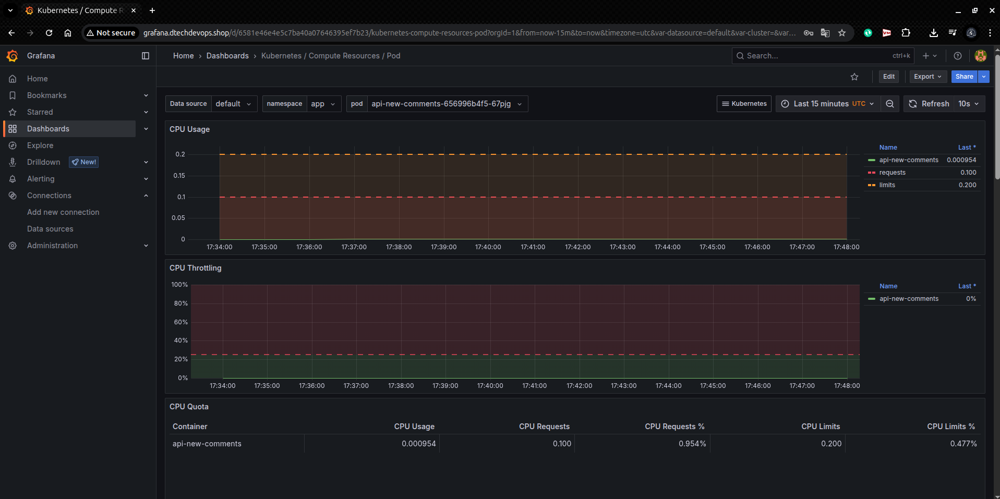
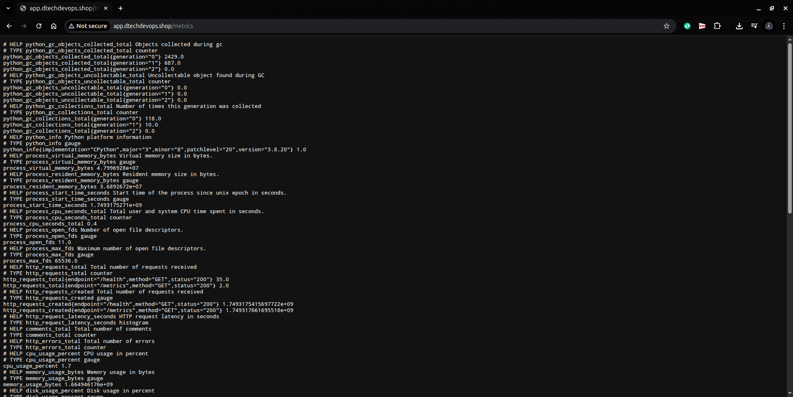

# Pipeline de Automação EKS

## Visão Geral
Este projeto implementa uma pipeline completa para automatizar a criação, implantação e monitoramento de aplicações em um cluster Amazon EKS (Elastic Kubernetes Service). A solução utiliza um conjunto robusto de ferramentas modernas para fornecer um ambiente de produção completo, escalável e facilmente gerenciável.

### Arquitetura
A arquitetura do projeto inclui:
- Cluster EKS gerenciado
- AWS Load Balancer Controller para gerenciamento de ingress
- Karpenter para auto-scaling
- ExternalDNS para gerenciamento de DNS
- Prometheus e Grafana para monitoramento
- Helm para gerenciamento de pacotes Kubernetes

## Componentes Principais

### 1. Infraestrutura como Código (IaC)
- Terraform para provisionamento da infraestrutura
- Gerenciamento de estado remoto via S3
- Configuração automatizada de recursos AWS

### 2. Container Registry
- AWS ECR para armazenamento de imagens Docker
- Pipeline automatizada para build e push de imagens

### 3. Cluster EKS
- Provisionamento automatizado do cluster
- Configuração de networking e segurança
- Integração com serviços AWS

### 4. Monitoramento e Observabilidade
- Prometheus para coleta de métricas
- Grafana para visualização e dashboards
- Alertas configuráveis
- Métricas customizadas da aplicação

## Pré-requisitos

### Requisitos Técnicos
* Conta AWS com acesso à CLI da AWS
* Bucket S3 para armazenamento do terraform state
* Repositório ECR criado
* Zona hospedada no Route53

### Permissões AWS Necessárias
* Permissões para criar e gerenciar recursos EKS
* Acesso ao ECR
* Permissões para gerenciar Route53
* Permissões para criar e gerenciar Load Balancers

## Pipeline de Implantação

### 1. Build e Deploy
* Build automatizado da imagem Docker
* Push para o repositório ECR
* Deploy da aplicação no namespace `app`

### 2. Infraestrutura
* Provisionamento do cluster EKS
* Instalação do AWS Load Balancer Controller
* Configuração do Karpenter para auto-scaling
* Setup do ExternalDNS
* Atualização automática do kube-config

### 3. Monitoramento
* Instalação do metrics-server
* Deploy do kube-prometheus via Helm
* Configuração do Grafana
* Setup de dashboards e alertas

## Aplicação

### Endpoints Disponíveis
* **Health Check:** `/` - Verifica o status da aplicação
* **Métricas:** `/metrics` - Endpoint Prometheus para coleta de métricas
* **Documentação API:** `/apidocs` - Interface Swagger com documentação da API

## Visualizações

### Grafana Dashboard

### Métricas da Aplicação

### Documentação Swagger

### Prometheus

## Contribuição
Para contribuir com o projeto:
1. Faça um fork do repositório
2. Crie uma branch para sua feature
3. Faça commit das suas alterações
4. Envie um pull request

## Suporte
Para suporte ou dúvidas, abra uma issue no repositório do projeto.

